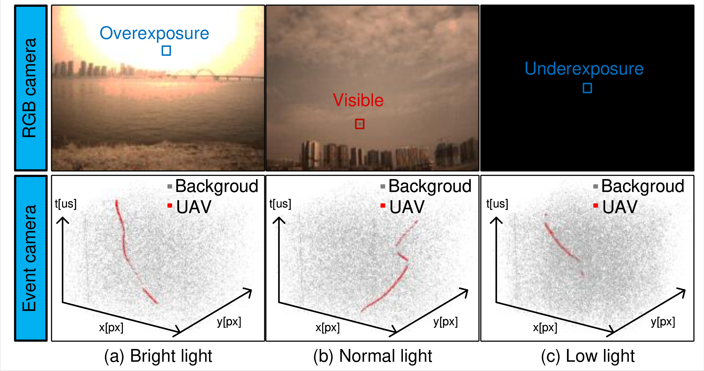
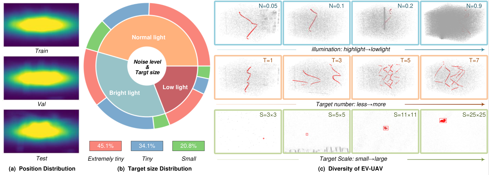
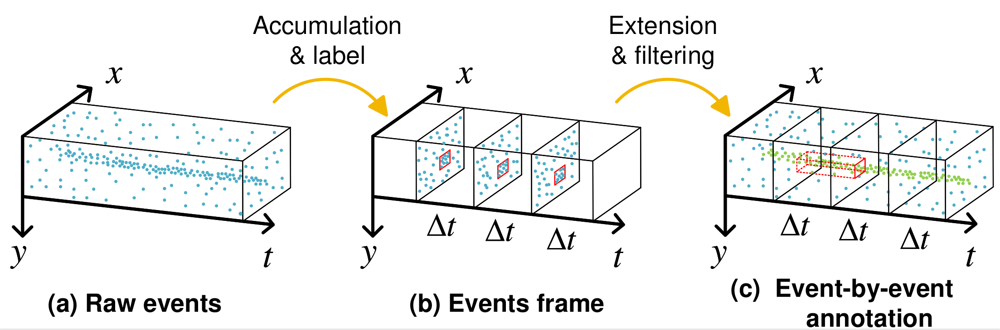
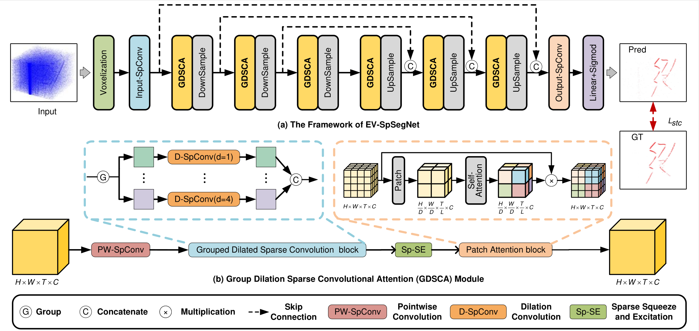
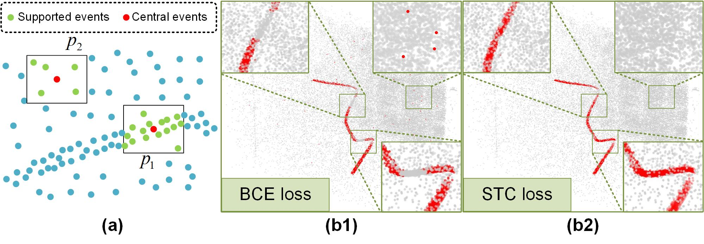

[ICCV 2025](https://iccv.thecvf.com/virtual/2025/poster/2540)

---
layout: section
---

# Outline

<Outline/>

---
layout: section
---

# Abstract & Conclusion & Contribution

## 问题

- 因为无人机尺寸极小，背景复杂，所以小目标检测在**反无人机**任务中极具挑战
- 传统的**帧式相机**帧率低、动态范围有限、数据冗余，不适配反无人机小目标检测
- **事件相机**：`microsecond temporal resolution`、`high dynamic range`

## 方案

1. **EV-UAV数据集**：构建了首个大规模、多样性的基于事件相机的反无人机小目标检测数据集
2. **EV-SpSegNet**：观察到微小目标在时空事件点云中形成连续曲线，提出了：基于事件的稀疏分割网络
3. **STC**: 设计了时空相关性损失函数

---

# Event-Based Camera

- 事件相机是一种受生物视觉启发的传感器，能够以微秒级时间分辨率（≥10⁶赫兹）和高动态范围（120 分贝）异步捕捉每个像素的亮度变化，每个像素都会独立地对光强变化做出响应

- 当亮度的对数值变化达到阈值时，触发事件：`E=(x,y,t,p)`，将运动信息编码为稀疏的时空事件流

<figure>
  <figcaption>Event Camera vs Frame Camera</figcaption>
  
</figure>

<Remark text="x,y表示像素坐标，t表示时间戳，p表示亮度变化的正负"/>

---

# EV-UAV Dataset

- 捕获动作：前后移动、横向移动、升降以及复杂组合
- 环境：正常、强光、弱光以及多种背景
- 147段数据序列精细标注，超过2030万个目标事件

<figure>
  <figcaption>Event Camera vs Frame Camera</figcaption>
  
</figure>

---

# Annotation

> 把零散的三维事件流先拼成二维帧标框，再把框连成三维时空块，给每个事件点打上 “目标 / 背景” 标签，完成事件级标注

<figure>
  <figcaption>Event Annotation</figcaption>
  
</figure>

<Remark text="二维红色框表示无人机位置，三维红色方框表示无人机在这段时间内所有运动轨迹上的事件点"/>

---

# Method

> GDSCA(Grouped Dilated Sparse Convolution Attention)

- 通过**分组空洞稀疏卷积**模块捕获局部多尺度特征
- 利用**块注意力**实现跨块的全局特征交互
- 即解决了传统感受野受限的卷积操作无法有效捕捉全局特征的问题，又解决了普通注意力处理大规模事件数据计算量太大的问题，可以很好的区分目标和背景噪声

<figure>
  
</figure>

---
layout: section
---

# Loss

<figure>
    
</figure>

    

        <h2>BCE</h2>
        <MathBlock :formula="bce" />
    

    

        <h2>STC</h2>
        <MathBlock :formula="stc"/>
        <MathBlock :formula="w"/>
    

---
layout: end
---
# Thanks
